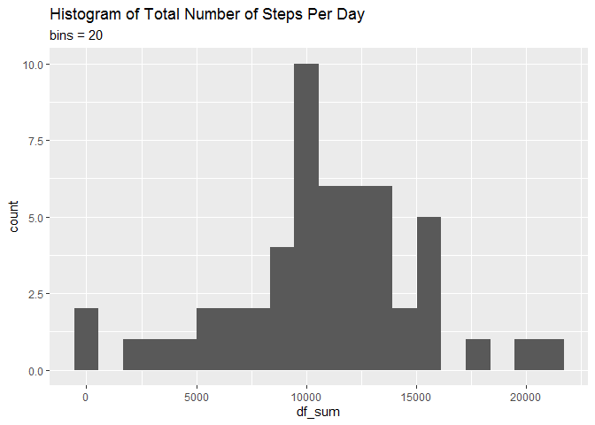
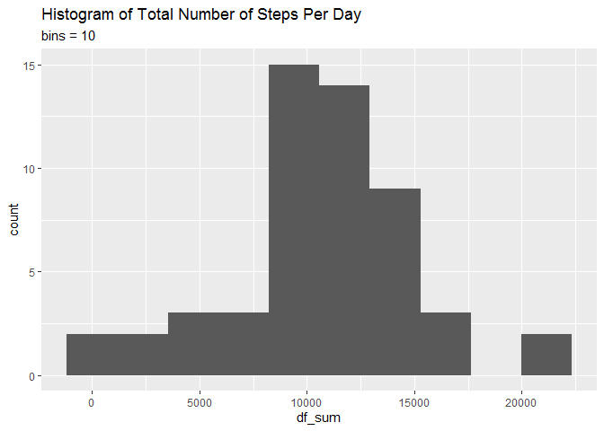
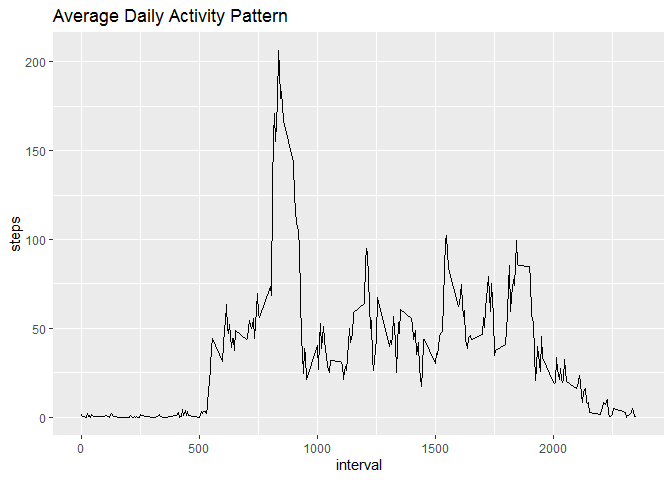
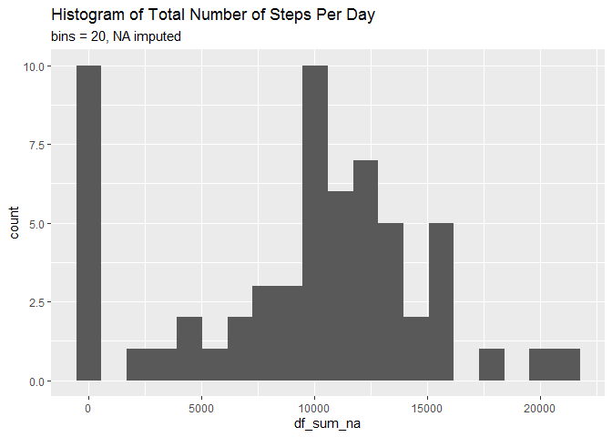
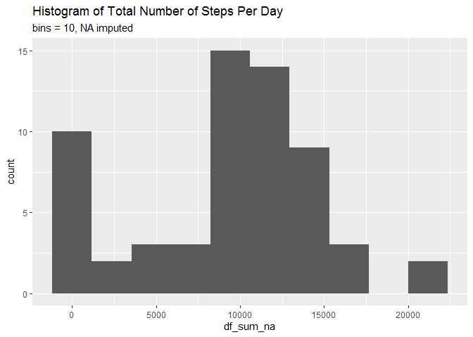
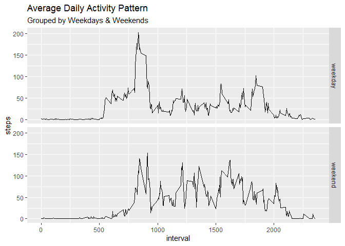

The following EDA is a requirement for Coursera: Reproducible Research by John Hopkins University. Analysis that were provided were based on the given instructions on its Peer-graded Assignment.

Before proceeding, the analysis requires installing `ggplot2` into R. While most of the functions used were from the `base` (and `stats`) package, `ggplot2` shall be used for data visualization.


```r
library(ggplot2)
```

The following versions was used based from its last render of this file. It is beyond my knowledge if such differences in version could affect the results of the analysis. Nevertheless, it would be given for documentation purposes.


```r
R.Version()$version.string
```

```
## [1] "R version 4.0.2 (2020-06-22)"
```

```r
packageVersion("ggplot2")
```

```
## [1] '3.3.2'
```

```r
Sys.time()
```

```
## [1] "2020-10-12 20:13:28 CST"
```

---

## Loading and preprocessing the data

Your current working directory should have a zip file named `activity.zip`. This can be obtained through this [link][*]. However, it is recommended to clone the repository, <https://github.com/KaidenFrizu/RepData_PeerAssessment1>, to minimize loading errors. 


```r
file.exists("activity.zip")
```

```
## [1] TRUE
```

If the code above evaluates to `FALSE`, you might have to recheck your current working directory or the downloaded file (if it was renamed to something else). Otherwise, load the data by extracting the zip file and read the csv file using `read.csv`.


```r
unzip("activity.zip")

dataframe <- read.csv("activity.csv", header = TRUE
                      ,colClasses = c("numeric","character","numeric")
                      ,na.strings = "NA")
```

Take note that all cells typed as a character `"NA"` will be marked with actual `NA`s to run the analysis smoothly. Another thing to point out is the column classes where its three columns will be assigned by the following classes to avoid possible variable type errors.

In the `interval` column, the following numbers are the minutes elapsed from midnight. Although this would be used for visualization, it would be complicated to determine the exact time frame from each cell, especially when dealing with `weekday` and `weekend` problem (To be explained in the later section).

To mitigate the problem, convert first the `interval` column to proper time format with character class.


```r
dataframe$time <- format(strptime(sprintf('%04d', dataframe$interval)
                                      ,format = '%H%M')
                             ,'%H:%M')
```

Then, create a new column with combined date and time.


```r
dataframe$datetime <- as.POSIXct(paste(dataframe$date, dataframe$time)
                                 ,format = "%Y-%m-%d %H:%M")
head(dataframe)
```

```
##   steps       date interval  time            datetime
## 1    NA 2012-10-01        0 00:00 2012-10-01 00:00:00
## 2    NA 2012-10-01        5 00:05 2012-10-01 00:05:00
## 3    NA 2012-10-01       10 00:10 2012-10-01 00:10:00
## 4    NA 2012-10-01       15 00:15 2012-10-01 00:15:00
## 5    NA 2012-10-01       20 00:20 2012-10-01 00:20:00
## 6    NA 2012-10-01       25 00:25 2012-10-01 00:25:00
```

```r
lapply(dataframe, FUN = class)
```

```
## $steps
## [1] "numeric"
## 
## $date
## [1] "character"
## 
## $interval
## [1] "numeric"
## 
## $time
## [1] "character"
## 
## $datetime
## [1] "POSIXct" "POSIXt"
```

With the appropriate date and time variables with different classes, analysis relating to time would be much simpler in the future sections.

---

## What is mean total number of steps taken per day?

Using `tapply`, the total number of steps will be added based on its date and it returns a vector of the sum of steps with its corresponding date as its row name.


```r
df_sum <- tapply(dataframe$steps
                 ,dataframe$date
                 ,FUN = sum)
print(df_sum)
```

```
## 2012-10-01 2012-10-02 2012-10-03 2012-10-04 2012-10-05 2012-10-06 2012-10-07 
##         NA        126      11352      12116      13294      15420      11015 
## 2012-10-08 2012-10-09 2012-10-10 2012-10-11 2012-10-12 2012-10-13 2012-10-14 
##         NA      12811       9900      10304      17382      12426      15098 
## 2012-10-15 2012-10-16 2012-10-17 2012-10-18 2012-10-19 2012-10-20 2012-10-21 
##      10139      15084      13452      10056      11829      10395       8821 
## 2012-10-22 2012-10-23 2012-10-24 2012-10-25 2012-10-26 2012-10-27 2012-10-28 
##      13460       8918       8355       2492       6778      10119      11458 
## 2012-10-29 2012-10-30 2012-10-31 2012-11-01 2012-11-02 2012-11-03 2012-11-04 
##       5018       9819      15414         NA      10600      10571         NA 
## 2012-11-05 2012-11-06 2012-11-07 2012-11-08 2012-11-09 2012-11-10 2012-11-11 
##      10439       8334      12883       3219         NA         NA      12608 
## 2012-11-12 2012-11-13 2012-11-14 2012-11-15 2012-11-16 2012-11-17 2012-11-18 
##      10765       7336         NA         41       5441      14339      15110 
## 2012-11-19 2012-11-20 2012-11-21 2012-11-22 2012-11-23 2012-11-24 2012-11-25 
##       8841       4472      12787      20427      21194      14478      11834 
## 2012-11-26 2012-11-27 2012-11-28 2012-11-29 2012-11-30 
##      11162      13646      10183       7047         NA
```

It is observed that some elements are still coerced to `NA` because adding `NA` values will result to `NA` regardless of the sum of the other elements. Coincidentally, all values with `NA` are found within particular dates therefore, the process of interpreting central tendencies would be streamlined much faster.


```r
mean(df_sum, na.rm = TRUE)
```

```
## [1] 10766.19
```

```r
median(df_sum, na.rm = TRUE)
```

```
## [1] 10765
```

The mean of the given data is about 10766.19 while the median is 10765. This calculated central tendencies ignores `NA` values.

As observed in the code, finding the mean total like in the code above uses `na.rm = TRUE` to not consider means containing `NA` in the step daily summary as part of the count because setting it to `FALSE` will result in `NA`. Overall, the codes used ignore `NA`s and proceeds to the computation. The code for imputing `NA` values can be found in the later section.

The differences between the mean and median is significantly small. However, this computation ignores `NA` values, therefore it might have a significant change otherwise. This would be compared on the future section below.

To visualize this central tendency, the following code in `ggplot` was used to interpret the given mean and median. It is also a visualization of the histogram of the total steps each day.


```r
ggplot(mapping = aes(x = df_sum)) +
    geom_histogram(bins = 20) +
    ggtitle("Histogram of Total Number of Steps Per Day"
            ,subtitle = "bins = 20")
```

```
## Warning: Removed 8 rows containing non-finite values (stat_bin).
```

<!-- -->

As observed in the histogram, the highest sum frequencies falls on the 10000 range in which corresponds to the previously calculated mean. In addition, there are a number of frequencies on the extremes (the sides of the histogram) that could affect calculations. However, such a small number only causes little significance to the results.

To give an another view, the following graph shows the same histogram but with a fewer number of bins.


```r
ggplot(mapping = aes(x = df_sum)) +
    geom_histogram(bins = 10) +
    ggtitle("Histogram of Total Number of Steps Per Day"
            ,subtitle = "bins = 10")
```

```
## Warning: Removed 8 rows containing non-finite values (stat_bin).
```

<!-- -->

---

## What is the average daily activity pattern?

From `dataframe`, the function `aggregate` would retrieve the mean of each interval across all days. The result would return another data frame with the mean steps from each interval. This would be ideal for plotting discussed below.


```r
df_daily <- aggregate(.~ interval
                      ,data = dataframe[,c("steps","interval")]
                      ,FUN = mean)
head(df_daily)
```

```
##   interval     steps
## 1        0 1.7169811
## 2        5 0.3396226
## 3       10 0.1320755
## 4       15 0.1509434
## 5       20 0.0754717
## 6       25 2.0943396
```

Using `geom_line` in `ggplot2`, all points would be plotted across intervals. The higher the value on a particular interval, the higher the activity of an individual is (assuming that more steps determines higher activity).


```r
ggplot(data = df_daily, mapping = aes(x = interval, y = steps)) +
    geom_line() +
    ggtitle("Average Daily Activity Pattern")
```

<!-- -->

As observed, the highest number of steps on average within the interval is 206.17 that is located in interval 835. For documentation, the following codes were used to determine the said data.


```r
df_daily[df_daily$steps == max(df_daily$steps),"interval"]
```

```
## [1] 835
```

```r
max(df_daily$steps)
```

```
## [1] 206.1698
```

---

## Imputing missing values

In the previous section, we ignored `NA` values and checked their results and plots. This time, we would impute all missing values in the given data. To start, here is the number of `NA` values in the given dataset.


```r
sum(is.na(dataframe$steps))
```

```
## [1] 2304
```

To fill all the missing values, every `NA` in `steps` column will be assigned to a value of `0`. This is to assume that all `NA`s were some errors when standing or sitting (or any activity that does not need a step). Before doing so, the given dataset must be cloned and be assigned to `dataframe_na` and we will impute `NA`s using that cloned data frame.


```r
dataframe_na <- dataframe
dataframe_na[is.na(dataframe_na)] <- 0
head(dataframe_na)
```

```
##   steps       date interval  time            datetime
## 1     0 2012-10-01        0 00:00 2012-10-01 00:00:00
## 2     0 2012-10-01        5 00:05 2012-10-01 00:05:00
## 3     0 2012-10-01       10 00:10 2012-10-01 00:10:00
## 4     0 2012-10-01       15 00:15 2012-10-01 00:15:00
## 5     0 2012-10-01       20 00:20 2012-10-01 00:20:00
## 6     0 2012-10-01       25 00:25 2012-10-01 00:25:00
```

Then, we would compute for their total steps per day, its mean and its median the same way as before. Keep in mind that `na.rm` is always set to true avoid `NA` evaluation on the vector of steps.


```r
df_sum_na <- tapply(dataframe_na$steps, dataframe$date, FUN = sum)
print(df_sum_na)
```

```
## 2012-10-01 2012-10-02 2012-10-03 2012-10-04 2012-10-05 2012-10-06 2012-10-07 
##          0        126      11352      12116      13294      15420      11015 
## 2012-10-08 2012-10-09 2012-10-10 2012-10-11 2012-10-12 2012-10-13 2012-10-14 
##          0      12811       9900      10304      17382      12426      15098 
## 2012-10-15 2012-10-16 2012-10-17 2012-10-18 2012-10-19 2012-10-20 2012-10-21 
##      10139      15084      13452      10056      11829      10395       8821 
## 2012-10-22 2012-10-23 2012-10-24 2012-10-25 2012-10-26 2012-10-27 2012-10-28 
##      13460       8918       8355       2492       6778      10119      11458 
## 2012-10-29 2012-10-30 2012-10-31 2012-11-01 2012-11-02 2012-11-03 2012-11-04 
##       5018       9819      15414          0      10600      10571          0 
## 2012-11-05 2012-11-06 2012-11-07 2012-11-08 2012-11-09 2012-11-10 2012-11-11 
##      10439       8334      12883       3219          0          0      12608 
## 2012-11-12 2012-11-13 2012-11-14 2012-11-15 2012-11-16 2012-11-17 2012-11-18 
##      10765       7336          0         41       5441      14339      15110 
## 2012-11-19 2012-11-20 2012-11-21 2012-11-22 2012-11-23 2012-11-24 2012-11-25 
##       8841       4472      12787      20427      21194      14478      11834 
## 2012-11-26 2012-11-27 2012-11-28 2012-11-29 2012-11-30 
##      11162      13646      10183       7047          0
```

```r
mean(df_sum_na, na.rm = TRUE)
```

```
## [1] 9354.23
```

```r
median(df_sum_na, na.rm = TRUE)
```

```
## [1] 10395
```

It seems that the values did not changed as much. It's just that all `NA`s that was present before were replaced by `0`s. In addition, the values of their mean and median changed compared to the previous calculation which is10766.19 and 10766.19 respectively. Such difference in central tendencies could affect the results for future analysis.

To illustrate, the following code plots the histogram of the sum of steps each day.


```r
ggplot(mapping = aes(x = df_sum_na)) +
    geom_histogram(bins = 20) +
    ggtitle("Histogram of Total Number of Steps Per Day"
            ,subtitle = "bins = 20, NA imputed")
```

<!-- -->


```r
ggplot(mapping = aes(x = df_sum_na)) +
    geom_histogram(bins = 10) +
    ggtitle("Histogram of Total Number of Steps Per Day"
            ,subtitle = "bins = 10, NA imputed")
```

<!-- -->

Notice the rise of `0` frequencies because of the `NA` imputed values. This is a factor where its mean decreases than the previous calculation. The if such cases will be ignored, then the average daily pattern could be higher than what is expected. Worst case scenario is the incorrect highest mean number of steps. However, its sum number of steps have little impact on imputed `NA` values since it doesn't consider adding to begin with (same goes to `0`).

Anyway, this dataset shall be used in the next section for a more accurate analysis.

---

## Are there differences in activity patterns between weekdays and weekends?

This problem requires some custom function in order to be solved. The following code below is a function that uses a vector of dates and returns a vector of its corresponding classification (whether it's a `weekday` or `weekend`).


```r
daytype <- function(datetime) {
    datetime <- weekdays(datetime)
    result <- as.character()
    
    for(i in 1:length(datetime)) {
        if(datetime[i] == "Saturday" | datetime[i] == "Sunday")
            result <- c(result, "weekend")
        else
            result <- c(result, "weekday")
    }
    
    return(result)
}
```

Implementing the function is simply putting the `datetime` column and assign it to a new column named `type` from the given data frame.


```r
dataframe_na$type <- daytype(dataframe_na$datetime)
```

We would be using `aggregate` to compute for the mean grouped by their `interval` and `type`. Naturally, we would be subsetting the required columns and assign it to a new variable called `df_daily_type`


```r
df_daily_type <- aggregate(.~ interval + type
                           ,data = dataframe_na[,c("steps","interval","type")]
                           ,FUN = mean)
head(df_daily_type)
```

```
##   interval    type      steps
## 1        0 weekday 2.02222222
## 2        5 weekday 0.40000000
## 3       10 weekday 0.15555556
## 4       15 weekday 0.17777778
## 5       20 weekday 0.08888889
## 6       25 weekday 1.31111111
```

With that, we plot the given values (which are the steps) based from their intervals and grouped by their `type`. This would result a grid of two line plots for easier comparison.


```r
ggplot(data = df_daily_type, mapping = aes(x = interval, y = steps)) +
    geom_line() +
    facet_grid(type ~.) +
    ggtitle("Average Daily Activity Pattern"
            ,subtitle = "Grouped by Weekdays & Weekends")
```

<!-- -->

From the given line plot, it seems that the user has higher average daily pattern on the 0800 interval (8 am) during weekdays than on the weekends. However, the average daily pattern in the afternoon between intervals 1200 and 1500 (12pm to 3pm), is higher on the weekends than the weekdays. The rest of the times are pretty much the same.

---

[*]: https://d396qusza40orc.cloudfront.net/repdata%2Fdata%2Factivity.zip
